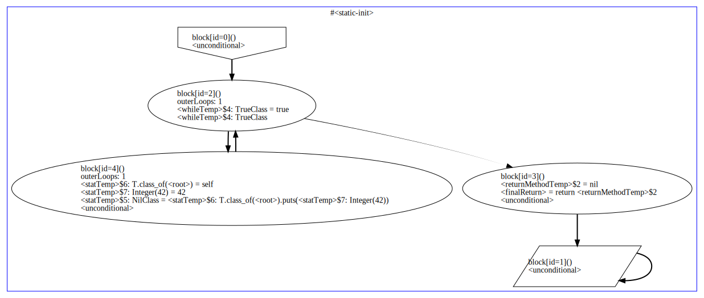

# Sorbet Internals

This doc is for people interested in learning how Sorbet works for the purpose
of contributing to the codebase.

For how to use Sorbet, see <https://sorbet.org/docs/overview>.
For how to build and test Sorbet, see the [README](../README.md).

Otherwise, welcome!

This document is a work in progress. Please ask questions when you encounter an
unfinished or confusing section!

<!-- START doctoc generated TOC please keep comment here to allow auto update -->
<!-- DON'T EDIT THIS SECTION, INSTEAD RE-RUN doctoc TO UPDATE -->
## Table of Contents

- [Overview](#overview)
- [Pipeline](#pipeline)
- [Phases](#phases)
  - [Parser](#parser)
  - [Desugar](#desugar)
  - [Rewriter](#rewriter)
  - [LocalVars](#localvars)
  - [Namer](#namer)
  - [Resolver](#resolver)
  - [CFG](#cfg)
  - [Infer](#infer)
- [Core](#core)
  - [`Ref`s (i.e., `Symbol` vs `SymbolRef`)](#refs-ie-symbol-vs-symbolref)
  - [`Symbol`s](#symbols)
- [Work In Progress](#work-in-progress)
  - [`Name`s](#names)
  - [`ast::Expression` (aka Trees)](#astexpression-aka-trees)
  - [`typecase`](#typecase)
  - [`core::Loc`](#coreloc)
  - [`beginError` and strictness levels](#beginerror-and-strictness-levels)
  - [The type system](#the-type-system)
  - [Parallelism in the pipeline, and substitutions](#parallelism-in-the-pipeline-and-substitutions)
  - [LSP](#lsp)
  - [RBI files and the payload](#rbi-files-and-the-payload)
  - [General tips for learning about sorbet](#general-tips-for-learning-about-sorbet)
  - [Other topics to document](#other-topics-to-document)

<!-- END doctoc generated TOC please keep comment here to allow auto update -->

## Overview

Sorbet is broken up into a main typechecking pipeline with a handful of
supporting utilities and data structures.

Briefly, this is the folder structure we're working with. (Note that this is not
comprehensive, but should give you a rough idea):

```
sorbet
│   // 1. Main
├── main
│   ├── pipeline    → Sequences the phases, feeding one phase into the next.
│   ├── lsp         → The language server-specific code.
│   ├── options     → Option parsing
│   └── autogen     → Stripe-specific, for autogen
│
│   // 2. Phases (more info below)
├── parser
├── ast
│   └── desugar
├── dsl
├── local_vars
├── namer
├── resolver
├── cfg
│   └── builder
├── infer
│
│   // 3. Other
├── common          → Non-Sorbet specific utilities and things that
│   │                 need to be everywhere.
│   └── os          → Platform-specific code.
├── core            → Sorbet-specific data structures and utilities.
│   └── types       → Our type system is shared by many passes of the
│                     pipeline code above.
│
│   // 4. Gems
├── gems
│   ├── sorbet          → The Ruby source for `srb init`.
│   └── sorbet-runtime  → The Ruby source for the runtime type checks.
└── ···
```

So by now you should have a rough sense for the high level structure of Sorbet.
The rest of this documentation is not meant to be read linearly. Feel free to
jump around between sections.

In particular, to understand the phases, you have to understand the core
abstractions, but being familiar with the phases motivates why certain core
abstractions exist.

## Pipeline

When learning about the phases in the next, it can be helpful to look at this
high-level architecture diagram of Sorbet's core type checking pipeline:

[→ docs/pipeline.md](pipeline.md)

## Phases

IR stands for "internal representation". Each phase either translates from one
IR to another, or modifies an existing IR. This table shows the order of the
phases, what IR they operate on, and whether they translate from one IR to
another or make modifications within the IR they were given.

> `*`: Even though these passes modify the IR they're given, they have another
> important job which is to populate GlobalState.
>
> `**`: This pass doesn't even modify the AST. It just emits errors.


|     | Translation Pass                 | IR                  | Rewrite Pass                      |
| --- | ----------------                 | --                  | ------------                      |
|     |                                  | source files        |                                   |
| 1   | [Parser], `-p parse-tree`        |                     |                                   |
|     |                                  | [`parser::Node`]    |                                   |
| 2   | [Desugar], `-p desugar-tree`     |                     |                                   |
| 3   |                                  | [`ast::Expression`] | [Rewriter]                        |
| 4   |                                  | [`ast::Expression`] | [LocalVars], `-p rewrite-tree`    |
| 5   |                                  | [`ast::Expression`] | [Namer], `-p name-tree` (*)       |
| 6   |                                  | [`ast::Expression`] | [Resolver], `-p resolve-tree` (*) |
| 6   |                                  | [`ast::Expression`] | [DefinitionValidator] (**)        |
| 6   |                                  | [`ast::Expression`] | [ClassFlatten], `-p ast`          |
| 7   | [CFG], `-p cfg --stop-after cfg` |                     |                                   |
| 8   |                                  | [`cfg::CFG`]        | [Infer], `-p cfg`                 |

When you see links to files below, you should **open the file** and give it a
quick skim before continuing. Most of the sections below are written like a
guidebook to the codebase to help you get where you're going, not a
comprehensive reference.

Sorbet has two flags which are invaluable for inspecting what happens from one
phase to the next:

- `-p, --print <state>`
  - Prints Sorbet's internal state, including any of the IRs.
  - Only some of the printing options are shown in the table above. See the help
    for all the options.
  - When getting started with Sorbet, oftentimes the `***-raw` variants of the
    printing options are more useful, until you get familiar with the codebase.
 - `--stop-after <phase>`
  - Stop Sorbet early

We will discuss individual phases and IRs below.

### Parser

The parser we're using is based on whitequark/parser, the popular Ruby parser.
The Ruby 2.4 whitequark parser was ported to yacc / C++ by Hailey Somerville
for use in her [TypedRuby] project, and has since seen many external
contributions to support later Ruby versions. You can find the sources in
`third_party/parser/`.

We interact with the TypedRuby parser using code generation to build a C++
header. To see the C++ header, first build Sorbet, then look inside bazel at
`bazel-genfiles/parser/Node_gen.h`.

The header itself is generated using [parser/tools/generate_ast.cc].

In general, the IR the parser generates models Ruby very granularly. This fine
granularity is frequently extra fine for the purpose of typechecking. We use the
Desugar and Rewriter passes to simplify the IR before typechecking.


### Desugar

The desugar pass translates from [`parser::Node`] into [`ast::Expression`]. The
goal of the desugarer is to drastically cut back on the granularity of the
parser's IR.

To give you some sense of the scope of the desugar pass, let's see some numbers.
At the time of this writing, there are 98 subclasses of `parser::Node`. There
are only 34 subclasses of `ast::Expression`.

To see the desugar pass, you'll want to look at [ast/desugar/Desugar.cc]. You'll
notice that it's mostly one large recursive function with a `typecase`. (See
below for more on `typecase`; it's basically "pattern matching as a function.")

Some examples of things we desugar in this pass:

- `case` expressions become chains of `if`/`else` expressions
- compound assignment operators (`+=`) become normal assignments (`x = x + 1`)
- `unless <cond>` becomes `if !<cond>`

If you pass the `-p desugar-tree` or `-p desugar-tree-raw` option to `sorbet`,
you can see what a Ruby program looks like after being desugared.


### Rewriter

The Rewriter pass is sort of like a domain-specific desugar pass. It takes
[`ast::Expression`]s and rewrites specific Ruby DSLs and metaprogramming into
code that Sorbet can analyze. DSL in this context can have a broad meaning. Some
examples of DSLs that are rewritten by this pass:

- `attr_reader` and friends are rewritten to simply define the methods that
  would be defined were the `attr_reader` method to be run (did you know that
  `attr_reader` is just a normal method in Ruby, not a language keyword?)

- `Chalk::ODM`'s `prop` definitions are written similarly to `attr_reader`

The core Rewriter pass lives in [rewriter/rewriter.cc].
Each Rewriter pass lives in its own file in the [rewriter/] folder.

We've envisioned the Rewriter pass as a potential extension point for some sort
of plugin system. This will allow for a wider audience of Rubyists to teach
Sorbet about DSLs they've written. This is why we've intentionally limited the
power of Rewriter passes.

Specifically, we artificially limit what code we call from Rewriter passes.
Sometimes it would be convenient to call into other phases of Sorbet (like
resolver or infer), but instead we've reimplemented functionality in the
Rewriter pass. This keeps the surface area of the API we'd have to present to
plugins in the future small.


### LocalVars

This is a fairly short pass. It converts the `ast::UnresolvedIdent` AST nodes
that correspond to local variables to `ast::Local` nodes (`ast::UnresolvedIdent`
nodes are also used for instance variables, class variables, and global
variables, not just local variables, but those are handled by other phases).

For the most part doing this is very straightforwardly accomplished with a tree
traversal. One trick is that local variables record which Ruby block (like `do
... end`) they're a part of. (Ruby blocks introduce new lexical scopes; things
like `if` / `else` and `begin` / `end` expressions do not.)

### Namer

Namer is in charge of creating `Symbol`s for classes, methods, globals, and
method arguments. (Counterintuitively, Namer is not in charge of creating
`Name`s. See below for the difference between [`Symbol`s] and [`Name`s].)

The file you'll want to see is [namer/namer.cc].

Symbols are the canonical store of information about definitions in Sorbet.
Namer walks the [`ast::Expression`] tree and calls various methods to create a
`Symbol` which is owned by `GlobalState` and get back a reference to what was
created (for example, `enterMethodSymbol` and `enterClassSymbol`). These methods
return a `SymbolRef`, which is conceptually a newtype wrapper around a pointer
to a `Symbol`. See below for a discussion of [`Symbol`s vs
`SymbolRef`s](#refs-ie-symbol-vs-symbolref).

The key datastructure for the Namer pass is the `Symbol` table, which we can
print out. Given this file:

<details>
<summary>Click to expand docs_example_1.rb</summary>

```ruby
class A
  def method(method_arg)
    local = 1 # no name will be created

    @field = 2

    $global = 3
  end

  # singleton methods are just methods on the singleton class
  def self.singleton_method(singleton_method_arg)
    # singleton fields are just fields on the singleton class
    @singleton_field = 4
  end

  @@static_field = 5
end
```

</details>

We'll see this symbol-table output:

```
❯ sorbet --no-stdlib -p symbol-table --stop-after namer docs_example_1.rb
class ::<root> ()
  field #$global @ docs_example_1.rb:7
  class ::A < ::<todo sym> () @ docs_example_1.rb:1
    method ::A#method (method_arg) @ docs_example_1.rb:2
      argument ::A#method#method_arg<> @ docs_example_1.rb:2
  class ::<Class:A> < ::<todo sym> () @ docs_example_1.rb:1
    method ::<Class:A>#singleton_method (singleton_method_arg) @ docs_example_1.rb:11
      argument ::<Class:A>#singleton_method#singleton_method_arg<> @ docs_example_1.rb:11
```

Some notes:

- The output shows you the Symbol's kind (`class`, `method`, etc.).
- The nesting matches the internal structure. A class `Symbol` knows how to
  return its members. A method `Symbol` knows how to return its arguments.
- Some of the definitions in our example aren't here yet (i.e., most of the
  fields) because we need to know the inheritance hierarchy first. See Resolver.
- None of the type / inheritance information is filled in yet. This is left to
  [Resolver].

> Namer used to be a relatively simple phase. It still conceptually follows this
> pattern (walk definitions, create `Symbol`s for definitions) but it has been
> optimized for parallelism and speed.
>
> See [Namer & Resolver Pipeline](namer-resolver-pipeline.md) for more details.


### Resolver

After [Namer] has run, we've created [`Symbol`s] for most (but not all) things,
but these `Symbol`s haven't been woven together yet. For example, after Namer,
we had a bunch of `Symbol`s marked `<todo sym>` representing classes' ancestors.
Another example: after Namer, we'd created `Symbol`s for methods, but none of
these `Symbol`s carried knowledge of their arguments' types.

There are many specialized jobs of Resolver, but we're just going to call out
two: resolve constants, and resolve sigs. We'll discuss each in turn.

**Resolve constants**: After Namer, constants literals (like `A::B`) in our
trees manifest as `UnresolvedConstantLit` nodes. An `ast::UnresolvedConstantLit`
node wraps a `NameRef` while an `ast::ConstantLit` wraps a `SymbolRef`. In these
terms, the process of resolving constants is to convert `Name`s into `Symbol`s
(`UnresolvedConstantLit`s into `ConstantLit`s).

**Resolve sigs**: Once constants have been resolved to proper `Symbol`s, we can
fill in type information (because signatures are mostly just hashes of
constants). To fill in a sig, Sorbet parses information out of the `ast::Send`
nodes corresponding to sig builder methods, uses this to create `core::Type`s,
and stores those types on the `Symbol`s corresponding to the method and
arguments of that method.

<!-- TODO(trevor) Do we want to talk about resolve type members here? -->

There are a handful of other things that the Resolver does (it computes and
records a linearization of the ancestor hierarchy so `derivesFrom` checks are
fast, it computes bounds for generic type members, it handles [`T.type_alias`]
declarations, it finalizes the information needed to power [`T.attached_class`],
etc.) There are pretty good comments at the top of [resolver/resolver.cc] which
say more.

To give you an idea, this is what our Namer example looks like after the
Resolver pass:

```
❯ sorbet --no-stdlib -p symbol-table --stop-after resolver docs_example_1.rb
class ::<root> < ::Object ()
  field #$global @ docs_example_1.rb:7
  class ::A < ::Object () @ docs_example_1.rb:1
    method ::A#<static-init> () @ docs_example_1.rb:16
    static-field ::A#@@static_field -> T.untyped @ docs_example_1.rb:16
    field ::A#@field -> T.untyped @ docs_example_1.rb:5
    method ::A#method (method_arg) @ docs_example_1.rb:2
      argument ::A#method#method_arg<> @ docs_example_1.rb:2
  class ::<Class:A> < ::<Class:Object> () @ docs_example_1.rb:1
    field ::<Class:A>#@singleton_field -> T.untyped @ docs_example_1.rb:13
    method ::<Class:A>#singleton_method (singleton_method_arg) @ docs_example_1.rb:11
      argument ::<Class:A>#singleton_method#singleton_method_arg<> @ docs_example_1.rb:11
```

- Type information is filled in (everything after the `->` is new).
- All the `<todo sym>`s are gone (because constants have been resolved).
- There are more fields now (like `::A#@field`).

> Resolver has always been a somewhat complex phase. It has been made somewhat
> more complex with the introduction of parallelism, though it still
> conceptually follows the patterns discussed here.
>
> See [Namer & Resolver Pipeline](namer-resolver-pipeline.md) for more details.


### ClassFlatten

The class_flatten is the final pass that processes the AST. The goal
here is to move around all the nodes so that the final result only has top level
classes and they only contain method definitions. Code that executes at the
top-level of a Ruby class is gathered up into a special `self.<static-init>`
method inside that class. The top level statements in a file are moved to a
unique `<static-init>` method on the synthetic `<root>` object.

After this pass, all code that could be type checked is in a method. This means
that in the next pass, CFG, we can look only at `ast::MethodDef` AST nodes and
ignore `ast::ClassDef` nodes (all the information we could ever want about a
class def has already been entered into `GlobalState`).

> **Note**: There is also a phase in Rewriter called `rewritter::Flatten`. That
> pass is designed to pull nested `ast::MethodDef`s out into the top-level of a
> class. (This has some nice properties, e.g., it's possible to define all
> `Symbol`s without traversing into method bodies. And since it's done in
> [Rewriter], the output is cached and invalidated at the file level.)
>
> If you have better names for these two phases to make them more distinct, they
> would be very welcome!


### CFG

CFG is another translation pass, this time from [`ast::Expression`s] into
[`cfg::CFG`]. CFG here stands for "control flow graph."

Unlike `ast::Expression` which is highly recursive (i.e., an `ast::If` is pretty
much just three sub `ast::Expression`s), the CFG is largely flat. To
**drastically** simplify the structure of a CFG, it looks something like this:

```cpp
class LocalVariable {};
class Type {};
class Instruction {};

class Binding {
  LocalVariable local;
  Type          type;
  Instruction   instruction;
}

class BasicBlock {
  vector<Binding> bindings;
  LocalVariable   finalCond;
  Type            finalType;
  BasicBlock *    whenTrue;
  BasicBlock *    whenFalse;
}

class CFG {
  vector<BasicBlock *> blocks;
}
```

A CFG is pretty much a vector of basic blocks, and a basic block is a vector
of instructions that compute something and assign their result to a local
variable. None of the instructions in a basic block can branch (whether on a
condition or unconditionally). But at the end of a basic block, we allow one
branch. We distinguish the contents of one of the variables in the basic block
as the branch condition, and then record which other basic block to jump to
depending on the value of that variable (`whenTrue` when truthy, `whenFalse`
when falsy).

Again, the structure above is **highly** abbreviated; look at [cfg/CFG.h] and
[cfg/Instruction.h] for more specifics.

Note that while basic blocks can't have internal branches, they can still "jump"
by calling into other methods.

Some things which are different about Sorbet's CFG than other CFG's you might be
familiar with:

- In Ruby, nearly every instruction can `raise` inside a `begin ... rescue` and
  jump to the start of the `rescue` block before subsequent expressions in the
  `begin` block run. But in Sorbet, we pretend that the jump to the `rescue`
  block happens instead either immediately after entering the `begin`, or after
  all expressions in the `begin` have executed. This simiplifying assumption
  (either nothing has run or everything has run) is in practice enough to model
  the control-flow sensitive typing context of variables used inside the
  `rescue` block.

- Our CFG is **not** static single assignment (SSA), because we haven't needed
  the power that SSA gives rise to. Instead, we largely make do by "pinning"
  variables in outer scopes to a certain type, and saying that assignments
  to those variables in inner scopes (i.e., within a loop or if) must not
  change the variable's type.

Sorbet's use of a CFG for type inference is pretty cool. By doing inference on
the CFG and keeping careful track of file locations (see [`core::Loc`]),
Sorbet's inference algorithm can be very general. We only have to implement
typechecking for ~11 kinds of instructions (+ control flow) instead of all ~98
kinds of nodes in `parser::Node` or all ~34 kinds of nodes in `ast::Expression`.

It also makes it easier to implement dead code analysis and flow-sensitive
typing. And because basic blocks can't jump into basic blocks from a different
method, method bodies can be type checked independently of each other.

Note: if you have `graphviz` installed, you can render a CFG to an image:

```shell
tools/scripts/cfg-view.sh -e 'while true; puts 42; end'
```



Some notes about how to read these:

- each method gets its own box
- each method always has one entry and one exit block (with ids 0 and 1,
  respectively)
- bold arrows represent the `true` branch; thin arrows are the `false` branch
- each basic block declares the locals that must be in scope upon entry
- "dead" blocks are the blocks where there are no types next to the locals in a
  binding

### Infer

Infer is the last pass. It operates directly on a [`cfg::CFG`]. In particular,
when the CFG is created, each binding has `nullptr` its local's type. By the end
of inference, reachable bindings within basic blocks will have had their types
annotated with the result of inference.

Inference itself pretty much iterates over a (best-effort) topological sort of
the basic blocks. ("Best effort" because there might be cycles in basic blocks).
For each binding in each basic block, we

- check whether this instruction is well-typed (now that there are so few node
  types, this is not so hard!)
- use this binding to update our knowledge of the types for future bindings

This loop over instructions happens in [infer/environment.cc]. Look for
`processBinding`, which is a big `typecase` over each `cfg::Instruction` type.

By far the most complicated thing about inference is checking `cfg::Send`
instructions (method calls). Checking if a method call is well typed, and
figuring out what the return type should be is implemented in
[core/types/calls.cc].

Sorbet visits each binding at most once to decide on its type. There is no
backsolving for types or iterating until a fixed point, and there is no
constraint generataion plus unification step. This single-shot style of
inference is fast, because we only make one decision about typing per
instruction, but it restricts the power of Sorbet's inference in user-visible
ways. Also, since the CFG can have cycles, we require that within a cycle of
basic blocks a variable's type cannot be widened or changed. (See
<http://srb.help/7001>.)

The inference pass itself is largely just traversing the the CFG for each method
and processing bindings. It delegates much of the implementation of the type
system (like getting a method's result type, checking argument types, subtyping,
generics, etc.) to logic implemented [core/types/]. See below for a discussion
of how Sorbet's type system works.


## Core

> Core abstractions within Sorbet.

### `Ref`s (i.e., `Symbol` vs `SymbolRef`)

Sorbet is pretty fast. There are a couple of reasons for this, but one of them
is Sorbet's use of `Ref`s. A Ref (with a capital R) in Sorbet is a way to
uniquely identify an allocated object.

For example, Sorbet has a class called `Symbol` and another called `SymbolRef`.
A `SymbolRef` is conceptually a newtype wrapper around a pointer to a `Symbol`.
All `SymbolRef`s which point to the same `Symbol` are equal, so comparison can
be done quickly. `Symbol`s are then stored in `GlobalState`, so you can always
get the data for a `SymbolRef` to look up a `Symbol`'s fields.

There are a handful of such paired data structures: `Symbol`/`SymbolRef`, and
`Name`/`NameRef`, and `File`/`FileRef` are the most widespread.

Why not just use pointers? `Ref`s are usually smaller than an 8-byte pointer.
It's also nice to have the distinction reinforced in the type system. Also the
"dereference" operation on these types is written `foo.data*()` instead of
`*foo` or `foo->`. Sorbet subscribes to the philosophy that slow operations
should be longer to type.

We use various `.enterFoo` methods on `GlobalState` to create new
objects owned directly by `GlobalState`. These methods return `FooRef`s. These
objects can't be constructed any other way.

Also, the `SymbolRef`, `NameRef`, and `FileRef` types are nilable by default.
Any such `Ref` might not exist (you can check with the `.exists()` method).

### `Symbol`s

`Symbol`s are canonical stores of semantic information about definitions. They
carry types, parents, the kind of definition, locations where the definitions
was defined, etc. Most of the job of the [Namer] and [Resolver] passes are to
populate `GlobalState` with accurate `Symbol`s representing every definition in
a Ruby program.

`Symbol`s are then consumed by later passes to do interesting things, chiefly to
report type checking errors.

`Symbol`s are somewhat polymorphic. There is one `Symbol` class, but a `Symbol`
might represent a class, method, field, argument, etc. There is some bit packing
going on to represent all of these things with little overhead, so be sure to
use the public `Symbol` methods which `ENFORCE` that the operations you're
trying to do on a `Symbol` make sense for this kind of `Symbol`.

See [core/Symbols.h] and [core/SymbolRef.h] for more information.

- - -

## Work In Progress

<!-- TODO(jez) Finish everything in this section -->

> These are just extra things I don't have a solid idea of where to put yet.


### `Name`s

- Names: essentially "strings" but as numbers instead
- (not quite "just strings" because two `Name`s with identical printed name but
  different numbers are not equal.)
- (which is why we need substitutions to renumber merged trees)
- generate_names is changed frequently


### `ast::Expression` (aka Trees)

- `GlobalState` + treemap instead of explicit recursion
  - Avoids having to construct and deconstruct trees
  - Can instead just index into one tree
  - Link to chapter 4 of dmitry's thesis
- gotcha: cast_tree will just return `nullptr` if you pass in `nullptr`. if you
  expect that the thing you're trying to cast is not null, `ENFORCE` it!
- tagged pointers to avoid virtual dispatch

### `typecase`

- Basically pattern matching using C++ template hackery.

### `core::Loc`

- pronounced 'lohk' not 'lock'
- fast / bit hacks
- philosophy around useful error messages
- there is a canonical loc, because symbols can have multiple locs, and most
  code only wants to have to care about the "best" loc.

### `beginError` and strictness levels

- We use `beginError` which will first check whether we'll report this error
- Returns a builder, so that we can avoid the expensive parts of constructing
  the error message if we're not going to even report this error at the current
  file's strictness level.

### The type system

- document the type system of `core/Types.h`
- `T.self_type` is return type of `Object.dup`, conceptually
- lub → 'or'
- glb → 'and'
- intrinsic: compute result type of method as a function in C++, rather than
  through statically declaring its type with sigs.
- ground types vs proxy types (dmitry thesis 2.4)
- dependent object types (thesis)

### Parallelism in the pipeline, and substitutions

- Find the picture from dmitry's Sorbet Internals video

### LSP

- Idk how LSP works. Depending on scope, might want to have whole new section /
  doc to describe just LSP.
- LSP might change significantly soon. Might not want to document it yet.
- How to debug LSP in VSCode / locally?

### RBI files and the payload

- There are two builds of sorbet
  - one which reads stdlib rbi files from disk
  - one which stores all stdlib rbi files inside our binary and reads them
    directly into global state on startup

### General tips for learning about sorbet

- no but actually, click through all the links here and read the source
- set up jump-to-def in your editor (it **is** possible)
- use `sorbet -p` and <https://sorbet.run> liberally
  - look at the before and after of each pass
- use `lldb` to break on specific functions and step through the logic on small
  examples
- Finish this doc on things I learned about C++
  - <https://paper.dropbox.com/doc/1tl7PTJjFCHEQ21S8LSld>

### Other topics to document

- `sanityCheck`s and `ENFORCE`s
  - both: only in debug builds
  - `sanityCheck`: internal consistency check, run at pre-determined times (like
    "after desugar")
  - `ENFORCE`: in-line assertion (pre- / post-condition)
- `show` vs `toString`
  - most data structures have both methods
  - `show` is "something that could be shown to the user" (like Rust `Display`
    trait)
  - `toString` is "internal representation" (like Rust `Debug` trait)
- `gems/sorbet/` (`srb init`)
- `gems/sorbet-runtime/`
- `bazel build //foo --copt=-ftime-trace --spawn_strategy=local`
  - generates <chrome://tracing> profiles for clang

<!-- -- Links -------------------------------------------------------------- -->

<!-- Phase descriptions -->
[parser]: #parser
[desugar]: #desugar
[rewriter]: #rewriter
[localvars]: #localvars
[namer]: #namer
[resolver]: #resolver
[cfg]: #cfg
[infer]: #infer

<!-- IRs -->
[`parser::Node`]: #parser
[`ast::Expression`]: ../ast/Trees.h
[`cfg::CFG`]: ../cfg/CFG.h

<!-- Data structures -->
[`Symbol`s]: #symbols
[`Name`s]: #names
[`core::Loc`]: ../core/Loc.h

<!-- Files -->
[parser/tools/generate_ast.cc]: ../parser/tools/generate_ast.cc
[ast/desugar/Desugar.cc]: ../ast/desugar/Desugar.cc
[rewriter/rewriter.cc]: ../rewriter/rewriter.cc
[rewriter/]: ../rewriter/
[namer/namer.cc]: ../namer/namer.cc
[resolver/resolver.cc]: ../resolver/resolver.cc
[cfg/CFG.h]: ../cfg/CFG.h
[cfg/Instruction.h]: ../cfg/Instruction.h
[core/types/]: ../core/types/
[core/Symbols.h]: ../core/Symbols.h
[core/SymbolRef.h]: ../core/SymbolRef.h
[infer/environment.cc]: ../infer/environment.cc
[core/types/calls.cc]: ../core/types/calls.cc

<!-- External -->
[TypedRuby]: https://github.com/typedruby/typedruby
[`T.type_alias`]: https://sorbet.org/docs/type-aliases
[`T.attached_class`]: https://sorbet.org/docs/attached-class
