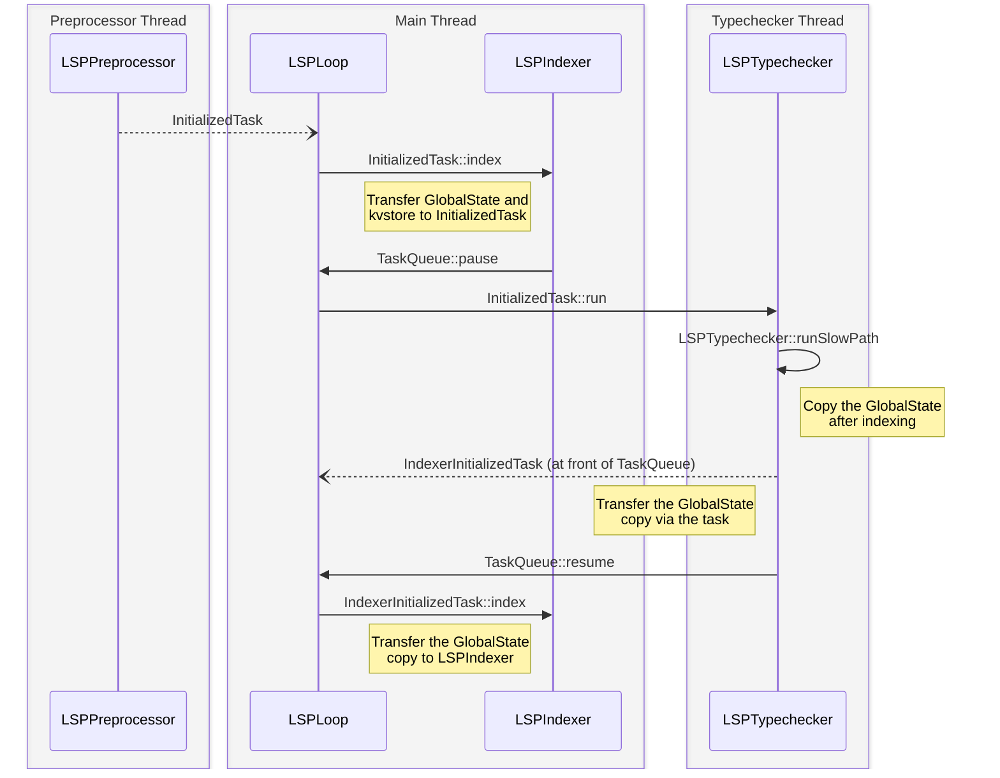
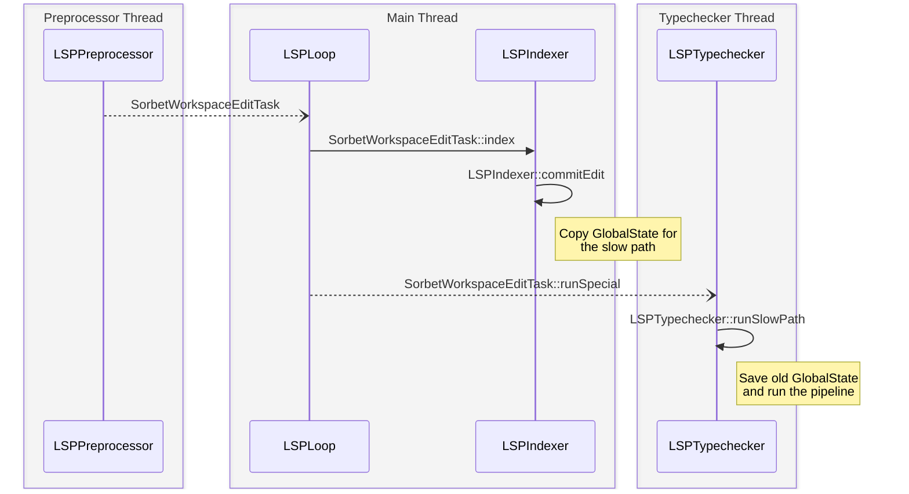

# LSP

## Initialization

Initialization begins when the `initialized` notification is sent by the client,
and received by the preprocessor thread. The preprocessor thread then immediately
queues a `InitializedTask` in the `TaskQueue` that the `LSPLoop` consumes.

That task is dequeued in the `LSPLoop` instance running on the main thread, and
run. When its `indexed` hook is called, it stashes away both the `GlobalState`
and `KeyValueStore` that are held by the `LSPIndexer` in an instance variable,
so that those values will be available later when the `run` hook for that task
is executed in the typechecker thread. As initialization is not cancelable or
preemptable, the task also pauses the `TaskQueue` that the `LSPLoop` is reading
from, to ensure that we don't attempt to handle any queries without a valid
`GlobalState` present.

Next the task's `run` hook is executed on the typechecker thread. This allows
the task to call the `LSPTypechecker::initialize` method, which kicks off a slow
path to populate the `GlobalState` that has been borrowed from the indexer. Once
the slow path has finished the indexing phase of the pipeline, it makes a copy
of the the `GlobalState` that can be sent back to the indexer thread. This copy
is made early on, as the indexer thread will never run passes that depend on the
symbol tables being populated, and thus it would be a waste of memory to copy
the `GlobalState` at the end of the whole pipeline.

Once the slow path finishes, the `LSPTypechecker::initialize` method creates an
`IndexerInitializedTask`, and moves the copied `GlobalState` to it. It then
places the task at the front of the queue, and unblocks the main thread again.
When the main thread wakes up and processes that event, the
`IndexerInitializedTask::indexed` hook will install the copy of the
`GlobalState` in the `LSPIndexer` instance, allowing it to begin answering
queries.

## Slow Path

