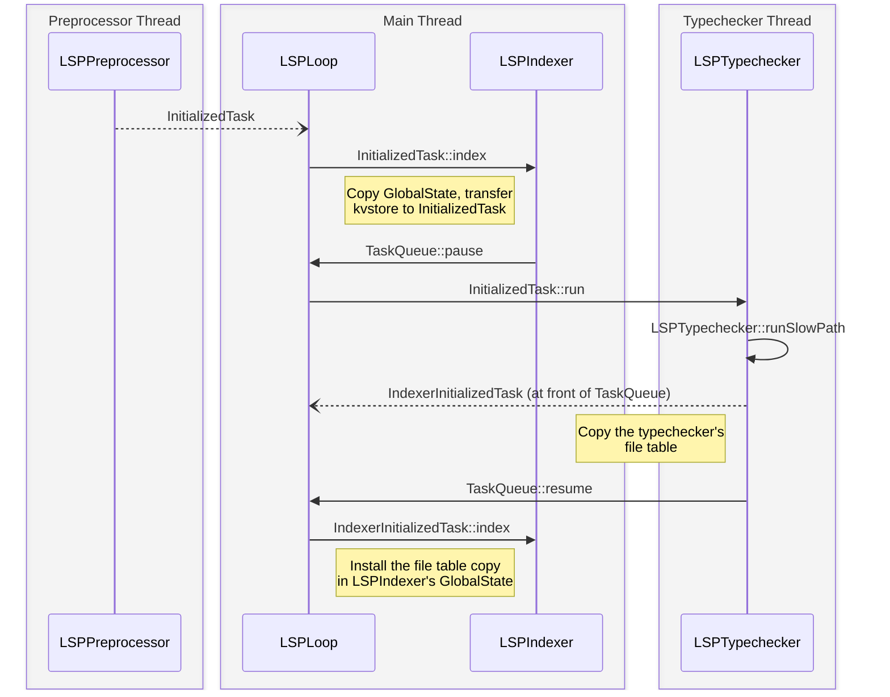
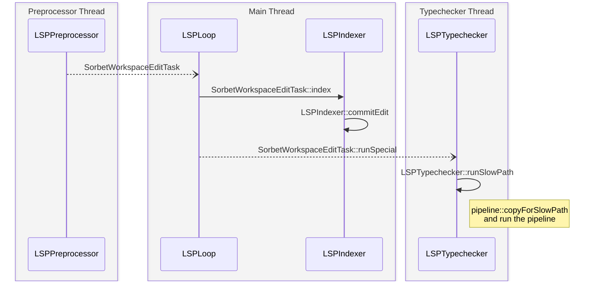

# LSP

## Initialization

Initialization begins when the `initialized` notification is sent by the client,
and received by the preprocessor thread. The preprocessor thread then
immediately queues a `InitializedTask` in the `TaskQueue` that the `LSPLoop`
consumes.

That task is dequeued in the `LSPLoop` instance running on the main thread, and
run. When its `index` hook is called, it copies the indexer's `GlobalState` and
takes ownership of the `KeyValueStore` that is held by the `LSPIndexer` in an
instance variable, so that those values will be available later when the `run`
hook for that task is executed in the typechecker thread. As initialization is
not cancelable or preemptable, the task also pauses the `TaskQueue` that the
`LSPLoop` is reading from, to ensure that we don't attempt to handle any queries
without a valid `GlobalState` present.

Next the task's `run` hook is executed on the typechecker thread. This allows
the task to call the `LSPTypechecker::initialize` method, which kicks off a slow
path to populate the `GlobalState` copy from the indexer, using the
`KeyValueStore` if it's available. Once the slow path has finished, the
typechecker makes a copy of its file table to send back to the indexer thread. 

> [!NOTE]
> Keeping the file tables of the indexer and typechecker threads in sync is
> necessary because the indexer uses both presence in the file table and the
> hashes for an entry to make decisions about which typechecking path to take:
> if either are missing the indexer has no way to take the fast path, and must
> default to the slow path.

The copy of the file table that's made in the `LSPTypechecker::initialize`
method is moved to an `IndexerInitializedTask`. The typechecker places the task
at the front of the queue, and unblocks the main thread again. When the main
thread wakes up and processes that event, the `IndexerInitializedTask::index`
hook will install the move the file table entries into the `GlobalState` in the
`LSPIndexer` instance.

## Slow Path

The slow path begins with the preprocessor thread translating edit events into a
`SorbetWorkspaceEdit` task. This task is then run on the main thread, and makes
a fast or slow path decision when its `index` hook is run.

When it's determined that the slow path will run, the `LSPIndexer::commitEdit`
method will be called from either the `index` hook, or the `runSpecial` hook,
depending on how many files are modified. This method will bundle up all of the
changes necessary for running the slow path into a `LSPFileUpdates` value.

As the slow path will be run, the `SorbetWorkspaceEdit::runSpecial` hook will be
run on the typechecker thread to typecheck the change. At this point the
`LSPTypechecker` will create a copy of its `GlobalState` that contains the file
table, the name table, and a payload-initialized symbol table. The original
`GlobalState` will be stashed away on an `UndoState` object, as well as any
other state that would need to be reverted in the event of a cancelation. It
begins running the slow path (which is very similar to initialization) and then
if it hasn't been cancelled, it will commit the new `GlobalState` and free the
state held by `UndoState`.
