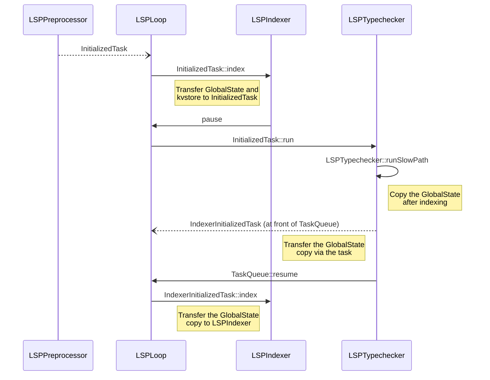
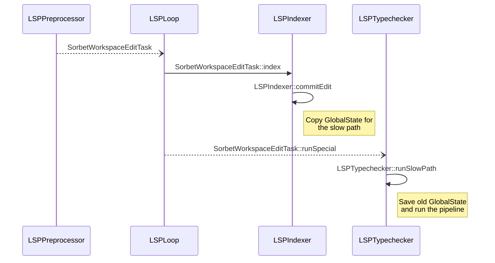

# LSP

## Initialization

```mermaid
sequenceDiagram
  participant LSPPreprocessor
  participant LSPLoop
  participant LSPIndexer
  participant LSPTypechecker

  LSPPreprocessor --) LSPLoop: InitializedTask
  LSPLoop ->> LSPIndexer: InitializedTask::index
  Note left of LSPIndexer: Transfer GlobalState and<br/>kvstore to InitializedTask
  LSPIndexer ->> LSPLoop: pause
  LSPLoop ->> LSPTypechecker: InitializedTask::run
  LSPTypechecker ->> LSPTypechecker: LSPTypechecker::runSlowPath
  Note right of LSPTypechecker: Copy the GlobalState<br/>after indexing
  LSPTypechecker --) LSPLoop: IndexerInitializedTask (at front of TaskQueue)
  Note left of LSPTypechecker: Transfer the GlobalState<br/>copy via the task
  LSPTypechecker ->> LSPLoop: TaskQueue::resume
  LSPLoop ->> LSPIndexer: IndexerInitializedTask::index
  Note left of LSPIndexer: Transfer the GlobalState<br/>copy to LSPIndexer
```

## Slow Path

```mermaid
sequenceDiagram
  participant LSPPreprocessor
  participant LSPLoop
  participant LSPIndexer
  participant LSPTypechecker

  LSPPreprocessor --) LSPLoop: SorbetWorkspaceEditTask
  LSPLoop ->> LSPIndexer: SorbetWorkspaceEditTask::index
  LSPIndexer ->> LSPIndexer: LSPIndexer::commitEdit
  Note right of LSPIndexer: Copy GlobalState for<br/>the slow path
  LSPLoop --) LSPTypechecker: SorbetWorkspaceEditTask::runSpecial
  LSPTypechecker ->> LSPTypechecker: LSPTypechecker::runSlowPath
  Note right of LSPTypechecker: Save old GlobalState<br/>and run the pipeline
```
