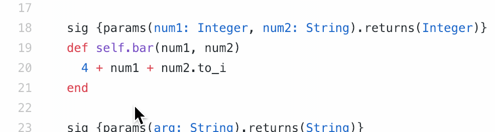

## Sourcegraph

You can get hover tooltips from Sorbet on GitHub with the [lang-ruby Sourcegraph extension](https://sourcegraph.com/extensions/sourcegraph/lang-ruby):



Here's how to run it:

```
./tools/scripts/update_sorbet_run.sh && tar -xvf ./bazel-bin/emscripten/sorbet-wasm.tar sorbet-wasm.wasm sorbet-wasm.js
npm install -g http-server
http-server --cors -p 5000 .
```

This will write `sorbet-wasm.wasm` to disk and serve it on port 5000. The lang-ruby Sourcegraph extension fetches the WebAssembly module from `http://localhost:5000/sorbet-wasm.wasm` (hard-coded for now).

Then open https://github.com/sourcegraph/lang-ruby/blob/master/sample.rb and you should see hover tooltips as shown above.