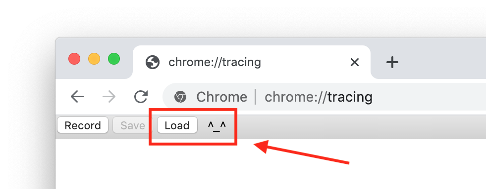
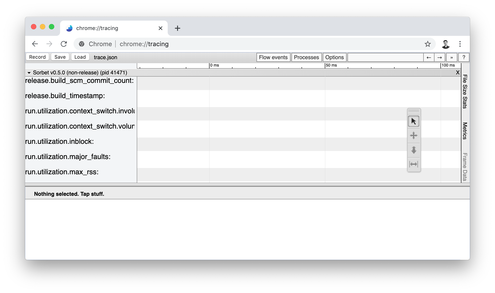
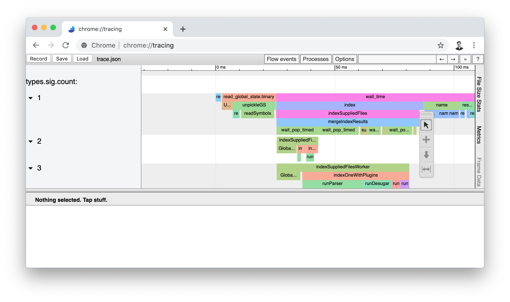
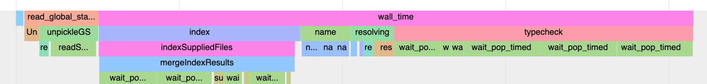
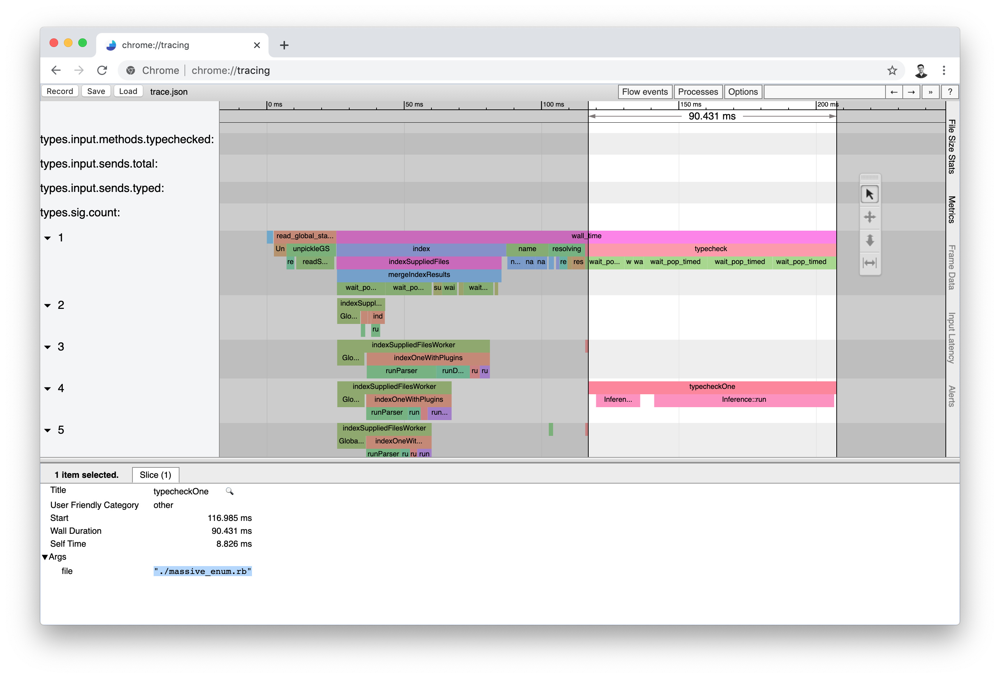

# Tracing Sorbet's Execution

Sorbet ships with the ability to emit a trace of its execution. This is the most
lightweight way to

- diagnose why Sorbet is slow on a particular codebase
- identify areas of Sorbet that could be made faster

This doc will walk through the process of how to collect such information, as
well as give some rough tips for how to interpret it.

> **Note**: Making sense of the output of Sorbet's trace information involves
> general familiarity with the architecture of Sorbet. If you haven't already,
> you'll want to read [pipeline.md](pipeline.md), which contains a high-level
> overview of the various phases of Sorbet.

## Collecting a trace

Sorbet reports trace files using Chrome's [Trace Event Format]. Traces files
generated using this format can be loaded into `chrome://tracing` and explored
interactively.

[Trace Event Format]: https://docs.google.com/document/d/1CvAClvFfyA5R-PhYUmn5OOQtYMH4h6I0nSsKchNAySU/preview

To collect a trace, run Sorbet with the `--web-trace-file=<file>` flag:

```bash
# If you've built Sorbet locally:
❯ bazel-bin/main/sorbet --web-trace-file=trace.json foo.rb

# or, if you're trying to trace a whole project:
❯ srb tc --web-trace-file=trace.json

# (If you're at Stripe, see http://go/types/tracing)
```

Sorbet will typecheck the file or codebase like normal, and then write out
`trace.json` (or whatever `<file>` name you chose).

### Tracing and LSP

The traces Sorbet submits are the same as the [metrics] that Sorbet submits to
StatsD (if enabled with the `--statsd-host` option).

[metrics]: https://sorbet.org/docs/metrics

For better performance in LSP mode, Sorbet will only report stats to the
specified host after it finishes processing a task **and** it's been 5 minutes
since the last stats dump.

Passing `--web-trace-file` overrides this behavior, forcibly flushing the trace
file and the StatsD stats after **every** task (no matter how long ago the last
flush was). This is often desired when debugging but can potentially cause
increased traffic on StatsD and/or slower IDE performance in normal operation.

## Loading a trace into the viewer

Once you've [Collected a trace](#collecting-a-trace), you can load it into the
viewer like this:

1.  Go to `chrome://tracing` in Chrome and click the `Load` button:

    

1.  Sometimes the trace viewer glitches out. If it looks like it did nothing the
    first time, try clicking the `Load` button and loading the trace file a
    second time.

1.  If it worked, you should see something like this:

    

    If your window is small like in the above screenshot, you'll need to scroll
    the trace into view with the mouse until you see some colorful bars like
    this:

    

The UI controls for the viewer take a little getting used to. You'll want to
play around to find what works for you, but:

- WASD controls the viewport. A/D pans left right, W/S zooms in and out.

- Clicking on an individual rectangle and pressing `m` marks that time interval
  on the entire timeline.

## Making sense of trace results

Trace results are a sort of flame graph. Each rectangle corresponds to a span of
time, which might have sub-spans within it.

You'll notice there are spans for individual phases of the pipeline which show
up close to the top of the trace:



The boxes like `index`, `name`, `resolving`, and `typecheck` map up with the
phases of Sorbet that are outlined in [pipeline.md](pipeline.md).

If you click on an individual box, you'll see metadata associated with that
event. For example, clicking on this `typecheckOne` box shows the name of the
file for that `typecheckOne` event:



You'll also be able to see a breakdown of Wall Duration and Self Time (in
milliseconds) for that event.

After that, there's not much more to point out. Look for bars that look
unreasonably long, and try to develop an intuition about what should or
shouldn't be slow. Mostly, this is built up by looking at lots of trace files to
get a sense for what is special about a certain trace.

For example, try comparing your current trace to a trace of your project from a
month ago, if you think that something recently became slow.

If you have a trace file that you'd like someone on the Sorbet team to look at,
feel free to share it with us, but know that it will contain potentially
sensitive information about your codebase, like names of files, methods, and
constants in your codebase.
