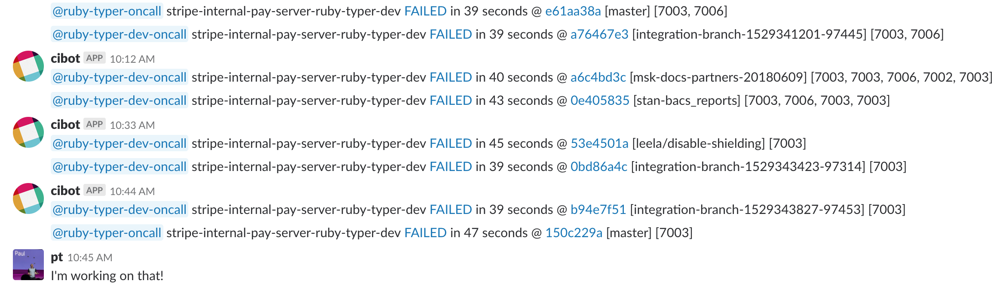
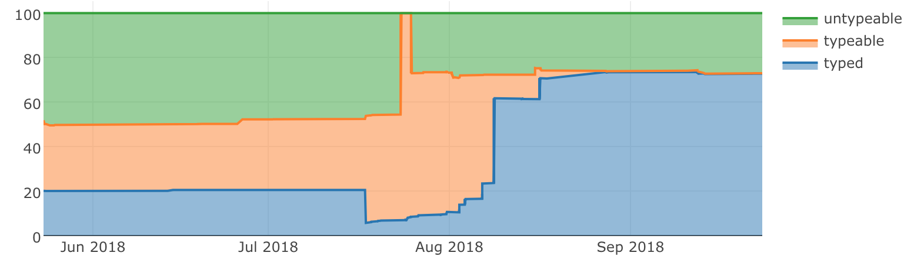
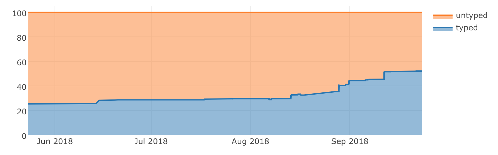

# Introductions

Note:
- dmitry: PhD Compiler architecture & a bit of type theory @ next major version of Scala Compiler(3.0)
- pt: Stanford grad, Previously at Facebook on HHVM and Hack

PT starts talking here

---

# Background

Note:

Don't say anything

---

## Stripe

- Platform that developers use to accept payments
- 25 countries, 100,000 business worldwide
- 84% of people in US have used it in the last year
- If you're running an internet business, check us out
- <a href="http://stripe.com/jobs">stripe.com/jobs</a>

Note:

---

## Developer productivity

Large dedicated team
- Testing
- Code
- Dev Env
- Abstractions
- Language Tools
- Etc.

Note:

- Context
- Not overhead

---

## Ruby at Stripe

- Ruby is the primary programming language
    - No Rails
    - Enforced subset of Ruby
- Most product code is in a monorepo (intentionally!)
- ~10 macroservices with a few microservices
- New code mostly goes into an existing service

Note: 

- Millions of lines of Ruby

---

## Stats

|Language                        | lines |||Language                        | lines |
|--------------------------------|------:|||--------------------------------|------:|
|Ruby                            |   34% |||Scala                           |    7% |
|Javascript                      |   16% |||HTML                            |    6% |
|YAML                            |   10% |||Go                              |    6% |

Millions of lines of code

Hundreds of engineers

Thousands of commits per day

Note: 

- Top languages
- Most product engineers use Ruby.
- Next language is 2% - bash

---

## Other ruby typing

- DRuby / PRuby / RubyDust / RTC / RDL by Jeff Foster
- Unreleased GitHub experiment by @charliesom

Note:
- Diamondback Ruby
- RDL Jeff Foster Maryland
- Charlie Somerville at Github

---

## Open source?

- Yes! Eventually
- Prove it out internally first
- Have questions? Reach us at <a href="mailto:sorbet@stripe.com">sorbet@stripe.com</a>

Note:

- Yes, we very much would like to open source this. 
- Today gather feedback and find folks who are interested in collaborating. 
- I hate throwing code over the wall. Instead we want to release when we can
dedicate the time to helping the community use it.
- But wait, this isn't just vaporware :) We have a browser demo.

Now open: https://sorbet.run/#%221%22%20%2B%202

---

## Try it &#8681;

https://sorbet.run

</img>

---

# Development

---

## Kickoff email

<style>
.reveal .email {
    text-align: left; 
    font-size: 18px;
}
.email div {
    padding: 20px 0;
}
.reveal .slides section .fragment.fade-out.visible {
    opacity: 1;
}
.reveal .email .emphasis {
    visibility: visible;
}
</style>
<div class="email">
<div class="fragment fade-out" style="padding: 0;">
<div>
Why add typechecking? In short, confidence. 
</div>

<div>
It <b class="emphasis">eliminates a whole class of errors</b>. How many NoMethodErrors do you think we
have a day? The answer may surprise you.
</div>
</div>

<div class="fragment fade-out">
We've seen it be very <b class="emphasis">successful in other languages</b> and companies. TypeScript
(Microsoft) and Flow (Facebook) for JavaScript. MyPy (Dropbox) for python. Hack
(Facebook) for PHP. Ruby is underinvested in by the community because few large
companies takes it as seriously as we do.
</div>

<div class="fragment fade-out">
Increased code mutability. We’ll be able to be much more <b class="emphasis">confident in our
codemods</b>, so that we will be able to keep our code a living, breathing, beast
instead of having pieces rot away.
</div>

<div class="fragment fade-out">
It makes you <b class="emphasis">think about your method interface</b> before writing. Do you take a
`Map<String, String>` or a `Array<Array<String>>`? This usually leads to more
composable code natively.
</div>

<div class="fragment fade-out">
It <b class="emphasis">makes code more readable</b>. Is a parameter named "merchant" a String merchant
ID, or an `Merchant` object? With type annotations, you never need to wonder
again. 
</div>
</div>

---

## Timeline ( 1/2 )

| Oct 2017 | Project kickoff
|-|-|
|| Try other type systems
|| Prototyping starts on C++
| Nov 2017 | Go/no-go date
||<div class="fragment highlight-green">Type Syntax</div>
|| Type System
| Feb 2018 | First code typed manually
| Apr 2018 | Rollout 

---

## Runtime system

* 1 year before
* Written in Ruby
* 5k `sig`s created by users

---

## Syntax changes are ok

```
standard_method({bar: Integer}, returns: String)
```
```
sig(bar: Integer).returns(String)
```
```
sig {params(bar: Integer).returns(String)}
```

Note:
This is only possible because of our monorepo

---

## Rejected syntax

```
Stripe::Declare.method
```
```
T::Any[Integer, String]
```
```
Integer | String
```
```
def foo(bar: T.(Integer)) T.(String)
```
```
def foo(bar: :T[Integer]) :T[String]
```
```
def String foo(Integer bar)
```

---

## Timeline ( 1/2 )

| Oct 2017 | Project kickoff
|-|-|
|| Try other type systems
|| Prototyping starts on C++
| Nov 2017 | Go/no-go date
|| Type Syntax
|| <div class="fragment highlight-green">Type System</div>
| Feb 2018 | First code typed manually
| Apr 2018 | Rollout 

Note:
  transition to Dmitry

---

## Type System Design Principles

- Explicit
- Feel useful, not burdensome
- As simple as possible, but no simpler
- Compatible with Ruby
- Scales
- Can be adopted gradually

---

## Explicit

```ruby
sig {params(a: Integer).returns(String)}
def foo(a)
  a.to_s
end
```


Note:
  We're willing to write annotations, and in fact see them as
  beneficial; They make code more readable and predictable. We're here
  to help readers as much as writers.

---

## Not burdensome: local inference

```ruby
sig {returns(String)} # Optional but not inferred
def foo
    a = 5 # Integer
    a = T.let("str", String) # String
end
```

Note:
 some people think that typesystems can be too verbose.
 We agree. This is why we want our to be concise.
 In particular here you don't need to specify type of variable a,
 we can infer that it is integer.

 If you do want to declare a type of variable, we you can do so with T.let.
 In this example, you re-assign a to a string and you explicitly daclare
 that you wanted a to become a string.

---

## Simple but no simpler

  - Nominal gradual typesystem
  - Generic classes & methods
  - Union and intersection types
  - Self types
  - Local type inference
  - Control-flow dependent typechecking
  - Static & runtime typechecking


Note:
  Overall, we are not strong believers in super-complex type
  systems. They have their place, and we need a fair amount of
  expressive power to model (enough) real Ruby code, but all else
  being equal we want to be simpler. We believe that such a system
  scales better, and -- most importantly -- is easiest for users to
  learn+understand.

---

## Scales

 - With team size
 - With number of teams that have different needs
 - With codebase size
   - Performance of the tool itself
   - Keeping codebase complexity isolated
 - With time (not postponing hard decisions)

Note:   On all axes: in speed, team size, codebase size and time (not
  postponing hard decisions). We're already a large codebase, and will
  only get larger.

---

## Compatible with Ruby

  - Standard ruby syntax
  - Works with existing tools: editors, linters & etc

Note: 
  In particular, we don't want new syntax. Existing Ruby syntax means
  we can leverage most of our existing tooling (editors, etc). Also,
  the whole point here is to improve an existing Ruby codebase, so we
  should be able to adopt it incrementally.

---

## Gradually: strictness level

```ruby
#
# Basic checks such as syntax errors are enabled by default
```

<div class="fragment">

```ruby
# typed: true
# Enables type checking
```

<div/>

<div class="fragment">

```ruby
# typed: strict
# Additionally requires all method definitions to be typed
```

<div/>

<div class="fragment">

```ruby
# typed: strong
# The safest level: disallows calling untyped code
```

<div/>

Note: 
​    In order to make adoption possible at scale, we cannot require all
​    the teams to adopt it at once, thus we need to support teams adopting it
​    at different pace.

---

## Gradually: runtime typechecking

---

## Why have runtime typechecking?

- Untyped code can call into typed code
- Untyped code can perform stores that are read by typed code
- Typed code cannot protect itself because we'll complain that the guard is dead

---

# Scales: performance

---
## Speed of our typer

100k lines/second/cpu core


| Tool | Speed (lines/s/core) |
|------|-------:|
| `sorbet`  | 100,000 |
| `javac`   | 10,000  |
| `rubocop` | 1,000   |
<!-- .element: class="fragment"  -->

---

## Versus CI

Speed at Stripe

| Tool | Speed | Parallel Machines |
|------|-------|-------------------|
| Sorbet | seconds | 1 |
| CI | 10 minutes | tens |

---

## Timeline ( 1/2 )

| Oct 2017 | Project kickoff
|-|-|
|| Try other type systems
|| Prototyping starts on C++
| Nov 2017 | Go/no-go date
|| Type Syntax
|| Type System
| Feb 2018 | First code typed manually
| Apr 2018 | <div class="fragment highlight-green">Rollout </div>

---

# Rollout: Tooling

---

## Gems

* Generated shims for > 300 gems
* All constants and methods are resolved
* Untyped
```
$ wc -l sorbet/shims/autogenerated/gems/*
677478 total
```

---

## Ruby Magic

* Load everything in Ruby -> Serialize reflection
* Load everything in Sorbet -> Serialize
* Load both -> Serialize diff
```
$ wc -l sorbet/shims/autogenerated/missing_methods/*
 251105 total
```


---

## Suggest Typed

```
$ ./scripts/bin/typecheck --suggest-typed --typed=true
...
You could add `# typed: true` to: `foo/bar.rb`
You could add `# typed: true` to: `foo/baz.rb`
...
```

---

## Autofix

```sh
foo.rb:311: Method strip does not exist on NilClass component 
            of T.nilable(String)
     311 |        status = match[1].strip.to_sym
                           ^^^^^^^^^^^^^^
  Autocorrect: Use `-a` to autocorrect
    foo.rb:311: Replace with T.must(match[1])
     311 |        status = match[1].strip.to_sym
                           ^^^^^^^^
```


---

## Most impactful things to type

---

## Guess sigs

Note:
  transition to Paul

---

## Timeline ( 2/2 )

| Feb 2018 | First sister-team
|-|-|
| Mar 2018 | First external user
| Apr 2018 | <div class="fragment highlight-green">Rollout</div>
| Jun 2018| Type most impactful functions
|| IDE
| Sept 2018 | Guessing of `sig`s <- NOW
| | De-magic-ing
| 2019 | Open Source

---

</img>

Note:
Code doubles roughly 2x each year

---

## Dark launch

* 60 days



---

## Give escape hatches

<pre style="box-shadow: none; font-size: 18px">
http://go/types

The ruby typechecker has found a possible error in your code.

If you believe this error is a false positive or is confusing or not
helpful, please let us know in <b class="fragment highlight-green">#ruby-types</b> or at ruby-types@stripe.com.

To run the <b class="fragment highlight-green">typechecker locally</b>, you can do any of:

- run `pay exec ./scripts/bin/typecheck`
- `pay start typecheck` then check your `pay up` window for errors
- run `./scripts/bin/lint` before committing

In addition, if you need to merge this code and don't want to or can't
figure out the type error, you can use one of these <b class="fragment highlight-green">workarounds</b> to
quiet the typechecker:

- Remove the `typed: true` comment from the files listed below.
- Wrap expressions in `T.unsafe(...)`. This function has no effect at
  runtime, and instructs the static checker to allow any or all method
    calls or operations on the resulting value.
</pre>

---

## Escape both ways

| | Runtime | Static |
|-|---------------------|
| `checked(false)` | X | ✓ |
| T.unsafe() | ✓ | X |


---

## Define metrics

* Percent of `typed: true` files
    * 0 -> 70% in 3 months
    * Group by error message
* Percent of method calls known
    * 25% -> 50% in 4 months
    * Group by Typed -> Untyped

Note:
25% came from typing the stdlib (which we graciously used from RDL)

---

## Typedness of files



---

## Calls resolved



---

## Human authored sigs


---

# Practical experience

Note:

Throwback to the title of our talk -- "a practical typechecker for
Ruby" -- and I want to link this to our experience at Stripe

These are some bugs we found in the process of rolling out the
typechecker, that slipped through CI and code review. Fortunately our
test coverage and processes are pretty good so none of these were
critical, but they are pretty informative of the experience of using
the tool and the kinds of issues we can catch.

- Examples are simplified but based on real code.

---

## Usage: dead code

```ruby
if Random.rand > 0.5
    foo = 1
else
    foo = 2
end
# foo is an Integer
```

<br/>

<div class="fragment">

```ruby
if Random.rand
    foo = 1
else
    foo = 2
end
```

```console
This code is unreachable
     6 |    foo = 2
                  ^
```

<div/>
Note:

  - We see that foo is assinged on both cases in first example
  - second example has a bug that could have been made by a C person.

---

## Typos in error handling

```ruby
    begin
      data = JSON.parse(File.read(path))
    rescue JSON::ParseError => e
      raise "#{PACKAGE_REL_PATH} contains invalid JSON: #{e}"
    end
```

```console
json.rb:6: Unable to resolve constant ParseError
    6 |  rescue JSON::ParseError => e
                ^^^^^^^^^^^^^^^^
   shims/gems/json.rbi:319: Did you mean: ::JSON::ParserError?
    319 |class JSON::ParserError < JSON::JSONError
         ^^^^^^^^^^^^^^^^^^^^^^^^^^^^^^^^^^^^^^^^^
```

---

## Errors in error handling

```ruby
   if look_ahead_days < 1 || look_ahead_days > 30
     raise ArgumentError('look_ahead_days must be between […]')
   end
```

```console
argumenterror.rb:9: Method ArgumentError does not exist on […]
```

Note:

Here we see another error inside an error-handling block. Someone
tried to call the function `ArgumentError`, instead of calling its
constructor -- perhaps they have been writing too much Python.

Here again we see that sorbert has identified the error and reported
that that method does not exist.

---

## `nil` checks

```ruby
app.post '/v1/webhook/:id/update' do
  endpoint = WebhookEndpoint.load(params[:id])
  update_webhook(endpoint, params)
end
```

```console
webhook.rb:16: Expression passed as an argument `endpoint`
    to method `update_webhook` does not match expected type
  16 |    update_webhook(webhook, params)
          ^^^^^^^^^^^^^^^^^^^^^^^^^^^^^^^

webhook.rb:10: Method update_webhook has specified type
    of argument endpoint as WebhookEndpoint
  Got T.nilable(WebhookEndpoint)
```

Note:

- strict nilability found a bug in an endpoint that handled an API
  request.
- This endpoint takes a Webhook ID from a user and updates it in our
  system
- the typechecker knows that `load` returns a webhook object or `nil`
  if that ID doesn't exist, and that `update_webhook` needs a
  non-`nil` webhook objecrt
- We detect the missing check

---

## `nil` checks (fixed)

```ruby
app.post '/v1/webhook/:id/update' do
  endpoint = WebhookEndpoint.load(params[:id])
  if endpoint.nil?
    raise UserError.new(:webhook_endpoint_not_found)
  end
  update_webhook(endpoint, params)
end
```

Note:

- Easy to fix; If we add the natural check you should have written
  anyways, we recognize the pattern and quiet the error

---

## Incorrect pattern matching

```ruby
  case transaction
      ...
      when Stripe::Charge || Stripe::Refund
      ...
  end
```


```console
case.rb:12: This code is unreachable
    12 |when Stripe::Refund || Stripe::Charge
                               ^^^^^^^^^^^^^^
```

Note:

Do a careful walk through

---


## User response

> Nice!! Beautiful errors and damn that was fast!!
> <!-- .element: class="smallquote"  -->

<span> </span>

> “DeveloperHappiness” would be a good name for ruby-typer
> <!-- .element: class="smallquote"  -->

<span> </span>

> I'm trying to use it locally, it's been super helpful to catch bugs in my own code.
> <!-- .element: class="smallquote"  -->

<span> </span>

> I introduced a typo with sed and ruby-typer caught it in CI within seconds of me pushing the branch.
> It’s really nice to get this kind of notification quickly rather than having to wait for potentially several minutes before the test job fails.
> <!-- .element: class="smallquote"  -->

---

## Closing
<style>
.reveal table.two-column td,
.reveal table.two-column th
{
   border-bottom: 0px; 
}
</style>

| Project kickoff | First sister-team
|-||-|
| Try other type systems | First external user
| Prototyping in C++ | Rollout
| Go/no-go date | Type impactful functions
| Type Syntax | IDE
| Type System | Guessing of `sig`s
| First code typed manually | De-magic-ing
|| Open Source
<!-- .element: class="two-column"  -->

---

# Thank you!

<a href="mailto:sorbet@stripe.com">sorbet@stripe.com</a>

</img>
